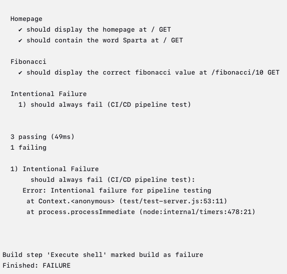
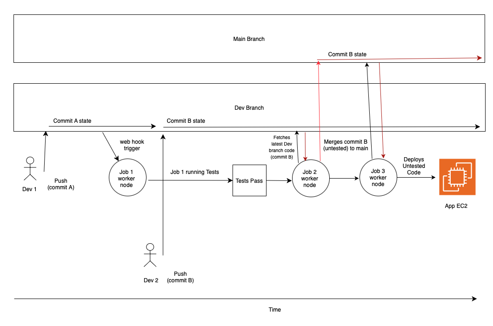

# Intro to Jenkins & CICD

- [Intro to Jenkins \& CICD](#intro-to-jenkins--cicd)
  - [CICD Overview](#cicd-overview)
    - [What is CI? Benefits?](#what-is-ci-benefits)
    - [What is CD? Benefits?](#what-is-cd-benefits)
    - [What is Jenkins?](#what-is-jenkins)
    - [Why use Jenkins? Benefits of using Jenkins? Disadvantages?](#why-use-jenkins-benefits-of-using-jenkins-disadvantages)
    - [Stages of Jenkins](#stages-of-jenkins)
    - [What alternatives are there for Jenkins](#what-alternatives-are-there-for-jenkins)
    - [Why build a pipeline? Business value?](#why-build-a-pipeline-business-value)
    - [What is a web hook, why is it needed in the context of a Jenkins pipeline?](#what-is-a-web-hook-why-is-it-needed-in-the-context-of-a-jenkins-pipeline)
  - [Creating and Running Jobs in Jenkins](#creating-and-running-jobs-in-jenkins)
    - [How to Create and Run a Job in Jenkins](#how-to-create-and-run-a-job-in-jenkins)
    - [How to View Console Output From a Job](#how-to-view-console-output-from-a-job)
    - [Triggering the Execution of Jobs](#triggering-the-execution-of-jobs)
  - [Building the CICD Pipeline](#building-the-cicd-pipeline)
    - [Pipeline Architecture](#pipeline-architecture)
    - [Job 1 - Running Tests](#job-1---running-tests)
      - [Pre-requisites](#pre-requisites)
        - [Setting up the GitHub Key Pair](#setting-up-the-github-key-pair)
      - [How to Create Job 1](#how-to-create-job-1)
      - [Setting up the Webhook to Trigger Job 1](#setting-up-the-webhook-to-trigger-job-1)
      - [Confirming Job 1 Works as Expected](#confirming-job-1-works-as-expected)
    - [Job 2 - Merging Dev into Main](#job-2---merging-dev-into-main)
      - [How to Create Job 2](#how-to-create-job-2)
      - [Job 2 Alternative Approach](#job-2-alternative-approach)
    - [Job 3 - Deploying the Code to an EC2 instance](#job-3---deploying-the-code-to-an-ec2-instance)
      - [Pre-requisites](#pre-requisites-1)
        - [Setup an EC2 Instance to Host the App](#setup-an-ec2-instance-to-host-the-app)
        - [AWS Key Pair](#aws-key-pair)
      - [How to Create Job 3](#how-to-create-job-3)
      - [Job 3 Alternative Approach](#job-3-alternative-approach)
  - [Working CI/CD pipeline](#working-cicd-pipeline)
  - [Benefits of the CI/CD Pipeline](#benefits-of-the-cicd-pipeline)
  - [Potential Problem?](#potential-problem)
  - [Questions and Answers](#questions-and-answers)
    - [What are the advantages of splitting the pipeline into three separate jobs?](#what-are-the-advantages-of-splitting-the-pipeline-into-three-separate-jobs)
    - [Why use a webhook?](#why-use-a-webhook)
    - [Why does only Job 1 use a web hook?](#why-does-only-job-1-use-a-web-hook)

## CICD Overview

### What is CI? Benefits?
* Continuous Integration
* Merging code
* Triggered by: Developers frequently pushing the code changes to shared repo
* Tests are run automatically on the code before it is integrated into the main code

Benefits:
* Help you to identify and resolve bugs early
  * Reduces costs
* Helps to maintain a stable and functional software build

### What is CD? Benefits?
* can mean:
  * Continuous Delivery (manual sign off/approval)
  * Or Continuous Deployment (automatically deploys code to production)
  
Continuous Delivery (manual sign off/approval)
* Ensure software is always in a deployable state, ready/can be pushed to production at any time
* often involves producing deployable artifact
* requires a manual release decision
* benefit
  * always have a deployable artifact ready to deploy to end users 

Continuous Deployment (automatically deploys code to production)
* extends Continuous Delivery by automating the final step of deploying to produciton 
* no manual intervention required
* benefit which is also a disadvantage:
  * removes the need for human approval, relies entirely on automated processes

### What is Jenkins?

* Automation server
* open-source
* primarily used for CICD, but can automate much more

### Why use Jenkins? Benefits of using Jenkins? Disadvantages?

* Benefits:
  * automation
  * extensibility: Jenkins has over 1800 plugins
  * Scalability: Jenkins server can scale easily by adding/using worker nodes/agents to run jobs
  * Community support
  * Cross-platform: Works across windows, linux, MacOS

* Disadvantages:
 * can be complex for beginners
 * Maintenance overhead
 * resource-intensive when running multiple jobs
 * User interface: outdated

### Stages of Jenkins

A typical Jenkins CICD pipeline involves the following stages: 
1. Source Code management (SCM)
2. Build: Compile the code, buidl into executable artifact
3. Test: Automated tests (unit, integration, etc)
4. Package: Package into deployable artifact
5. If using Cont. Deployment, the package is deployed into the target environment e.g. test, production
6. Monitor: Monitoring tools may be deployed/configured to observe performance, log issues, etc after deployment 

### What alternatives are there for Jenkins

* GitLab CI
* GitHub Actions
* CircleCI
* Travis CI
* Bamboo
* TeamCity
* GoCD
* Azure DevOps (Azure Pipelines to run the CICD pipelines)

### Why build a pipeline? Business value?

* Cost savings - automating repetitive processes
* Faster time to market
* reduced risk
* improved quality through continuous feedback and improvement

### What is a web hook, why is it needed in the context of a Jenkins pipeline? 

* A webhook is an HTTP callback: A way for one system to automatically notify another system when a specific even happens. Instead of repeatedly polling for changes, the source system pushes a message to a specific URL when something occurs e.g code is pushed
* The receiving system processes the event and triggers an action

## Creating and Running Jobs in Jenkins


### How to Create and Run a Job in Jenkins

Instructions to create a job:

1. Log into the Jenkins server
2. Click **New item**
* Give the project a name
* Select **freestyle** project
* Click **Ok**
* In the **General** section:
  * Give the project a description e.g. `testing jenkins`
  * Tick the box to discard old builds and set **Max # of builds to keep** to 5
* In the **Build Steps** section:
  1. click **Add build step**
  2. choose **Execute shell**
  3. paste `uname -a` into the text box
  4. click **Save**

* When ready to run the job, click **Build now**

### How to View Console Output From a Job

* How to find out what happened during a job:
  1. Click on the project link from the dashboard
  2. In the bottom left of the screen, click the link of the job execution
  3. Click **console output**

### Triggering the Execution of Jobs

Jobs can be set to execute on the successful completion of another job:

1. Click on a job
2. Go to the **configure** section
3. Scroll down to **Post-build Actions**
4. Click **Add post-build action** then select **Build other projects**
5. Type in the name of the project you want to run after
6. Leave the **trigger only if build is stable** option selected

## Building the CICD Pipeline

### Pipeline Architecture

The image below shows the pipeline to be built


* The webhook is used to notify Jenkins each time the code in the GitHub repository (dev branch) changes
* The different parts of the architecture connect securely using key pairs
* If the application code is changed e.g. in `app/views/index.js` then pushed to the dev branch, the pipeline executes
* If a job fails, the pipeline stops

### Job 1 - Running Tests

The purpose of Job 1 is to run the unit tests defined in `/app/test/test-server.js` and make sure the code passes all tests before code is merged to main branch

#### Pre-requisites

##### Setting up the GitHub Key Pair

* The Jenkins worker node requies the private key of the GitHub repo key pair to clone the GitHub repository. 

How to setup the repository key pair:

1. Open a terminal window on local machine
2. `cd` into the .ssh folder
3. Run: `ssh-keygen -t rsa -b 4096 -C "<email address>"`
4. Name the key pair: `joshua-jenkins-github-key`
5. Log into GitHub
6. Navigate to the CICD repo
7. Go into the settings for the individual repo
8. Click deploy keys on the left menu
9. Click add deploy key
10. Set the key pair title: `joshua-jenkins-github-key`
11. Copy the public key into the text area:
    1.  Find the `.pub` file created by the `ssh-keygen` command
    2.  Use `cat` to print the key to the terminal
    3.  Copy the entire output to the text area on GitHub for the public key
12. Tick **Allow write access** option - needed for Jenkins to perform `git push` in Job 3.
13. Click **Add key**

#### How to Create Job 1

1. Click **New item** from the Jenkins dashboard
   * Enter item name: `joshua-sparta-app-job1-ci-test`
   * Select Freestyle
2. Click **Ok**
* In the **General** section:
   * Add description: `do testing part of CI with webhook to trigger`
   * Tick **Discard old builds**
     * Strategy: Log rotation
     * Max # of builds to keep: 5
   * Tick **GitHub project** box
      * Project url: `https://github.com/Joshua-Onley/tech517-sparta-test-app-cicd/`
      * ❗Must remove `.git` from URL and replace with `/` if copying URL from GitHub
* In the **Source Code Management** section:
  * Select **Git**
    * Repository URL: `git@github.com:Joshua-Onley/tech517-sparta-test-app-cicd.git`
    * Click **Add** under **credentials**
    * Click **Jenkins**:
      * kind: SSH Username with private key
      * ID: name of key pair = `joshua-jenkins-github-key`
      * Username: `joshua-jenkins-github-key`
      * Description: `read/write to repo`
      * Private key
      * Click **Enter directly**
      * Click **Add**
      * Paste the GitHub repository private key in the text box
    * Branch specifier : */dev
* In the **Build Environment** section:
  * Tick the **Provide node and npm bin/ folder to PATH** option
* In the **Post-build actions** section:
  * In the **Projects to Build** dropdown, specify job 2
  * Select **Trigger only if build is stable** (Job 2 only runs if Job 1 is successful)

#### Setting up the Webhook to Trigger Job 1

1. Select job 1 from the Jenkins dashboard
2. Click **Configure**
3. Scroll down to the **Build triggers** section:
     * Choose **GitHub Hook trigger for GITScm polling**
4. Click **Save**
5. Go to GitHub repo settings
6. Go to Webhooks section
7. Click add webhook
     * Payload URL: `http://34.254.6.118:8080/github-webhook/` (jenkins server)
8. Click **Add webhook**


#### Confirming Job 1 Works as Expected

* If any tests fail during Job 1, Jobs 2 and 3 should never start.
* Test: Include a test case that is garunteed to fail. See if pipeline stops.

* I added the following test to the end of `app/test/test-server.js`

```js
describe('Intentional Failure', function() {
  it('should always fail (CI/CD pipeline test)', function() {
    throw new Error('Intentional failure for pipeline testing');
  });
});
```

* After pushing to the main branch and triggering the pipeline, job 1 is marked as failed
* No further jobs are triggered
* Console output:

  

* Job 1 works as expected


### Job 2 - Merging Dev into Main

#### How to Create Job 2

1. Click **New item** from the Jenkins dashboard
2. Select option to copy another Job
   * Copy from job 1
3. Click **Ok**
* Scroll to the **Build Triggers** section:
  * Untick **GitHub hook trigger for GITScm polling** (webhook does not trigger this job)
* Scroll to the **Build Environment** section:
  * Tick **SSH Agent**
  * In the credentials section, add the GitHub repo private key
  * ❗Must add SSH agent otherwise `git push` will fail
  * Untick **Provide Node & npm bin/folder to PATH** (**Execute shell** section does not use any npm commands)
* Scroll to the **Build Steps** section:
  * Select **Execute shell** and paste the following code to the text area:

    ```bash
    git checkout main
    git merge origin/dev
    git push origin main
    ```
  * `git checkout main` - Switches to the main branch
  * `git merge origin/dev` - Merges the dev branch to the main branch
  * `git push origin main` - Pushes the code to GitHub

* In the **Post-build Actions** section:
  * In the **Projects to build** dropdown, specify Job 3
  * Select **Trigger only if build is stable**
* Click **Save**

#### Job 2 Alternative Approach

* Instead of putting git commands in the **Execute shell** section, can use plugins

Instructions:
* Remove all code from **Execute shell** in the **Build Steps** section
* Scroll to **Post-build Actions** section:
  * Click **Add post-build action**
    * Select **Git Publisher**
      * Tick **Push Only If Build Succeeds**
      * Tick **Merge Results**
      * Branch to push: main
      * Target remote name: origin

### Job 3 - Deploying the Code to an EC2 instance

#### Pre-requisites

##### Setup an EC2 Instance to Host the App

1. Create an EC2 instance on AWS:
2. SSH into the EC2 instance
3. Create a script called `install-app-dependencies.sh` to install app dependencies: [install-app-dependencies.sh](install-app-dependencies.sh)
4. Add execute permissions to the script: `chmod +x install-app-dependencies.sh`
5. Run the script on the EC2 instance: `./install-app-dependencies`

##### AWS Key Pair

* Must generate an AWS key pair and attach it to the EC2 instance


#### How to Create Job 3

1. Click **New item** from the Jenkins dashboard
2. Select the option to copy another job
   * Select job 2
3. Click **Ok**
* Go to the **Build Environment** section:
  * Untick **Provide Node & npm bin/folder to PATH**
  * Select **SSH Agent**
    * Click **Add**
    * Select **SSH username with private key** and fill in the details of the AWS key 
* Go to the **Build Steps** section:
  * Select **Execute shell**
  * Paste the following code into the text area:

    ```bash
    # Copy the Sparta app repository to the ubuntu home directory
    scp -o StrictHostKeyChecking=no -r ./* ubuntu@<public IP of app VM>:~

    # SSH into the VM as the Ubuntu user and run commands to start the app
    ssh -o StrictHostKeyChecking=no ubuntu@54.195.43.141 << EOF
      cd app
      npm install
      pm2 stop all
      pm2 delete all
      pm2 start app.js
    EOF
    ```
* Click **Save**

#### Job 3 Alternative Approach

* Create a script on the app EC2 instance to handle the startup of the application: [deploy-app.sh](deploy-app.sh)
* Add execute permissions to the script: `chmod +x deploy-app.sh`
* Replace the **Execute shell** section code with:
   ```bash
    
    scp -o StrictHostKeyChecking=no -r ./* ubuntu@<public IP of app VM>:~

    ssh -o StrictHostKeyChecking=no ubuntu@54.195.43.141 "./deploy-app.sh"
    ```


#### Blockers

* By default, the `scp` and `ssh` commands do not work
* The following commands fail:
  
  ```
  scp -r ./README.md ./app ubuntu@54.195.43.141:~

  ssh ubuntu@54.195.43.141
  ```
* The error message:

  ```
  SSH known hosts error
  ```
* The issue: 
  * By default, SSH/SCP requies host key verification
  * When connecting to a new server for the first time, SSH:
   1. Retrieves the server's host key
   2. Prompts the user: `Are you want to continue connecting (yes/no)?`
   3. Stores the key in ~/.ssh/known_hosts
  * Since Jenkins cannot answer this prompt (because we cannot enter user input), the connection fails

* The fix:
  * Add the `-o StrictHostKeyChecking=no` flag into the scp command
  * This disables the SSH host key verification process


## Working CI/CD pipeline

* Can make a change to the source code on my local machine and push to GitHub (Dev branch)
* The changes are automatically tested, merged with main (only if tests pass), and deployed to EC2 instance

1st change to frontpage: 


Second change to frontpage:


## Benefits of the CI/CD Pipeline

* Able to quickly deploy code to production:
  * No need to manually run tests
  * No need to manually run git commands such as `git merge`
  * No need to manually copy code onto EC2 instance
  * No need to manually run application startup commandsj
* Reduced risk of human error - no risk of typing commands incorrectly if the pipeline is set up correctly.
* Safety - reduced risk of deploying buggy code to production


## Potential Problem?




## Questions and Answers

### What are the advantages of splitting the pipeline into three separate jobs?
* Can easily stop the pipeline if one job fails

### Why use a webhook?
* So the pipeline runs automatically without a human having to go into jenkins and click build now
* Saves time

### Why does only Job 1 use a web hook? 
* Job 2 is triggered by successful completion of job 1 
* Job 3 is triggered by successful completin of job 2
* Job 1 requires a webhook to trigger the start of the pipeline


