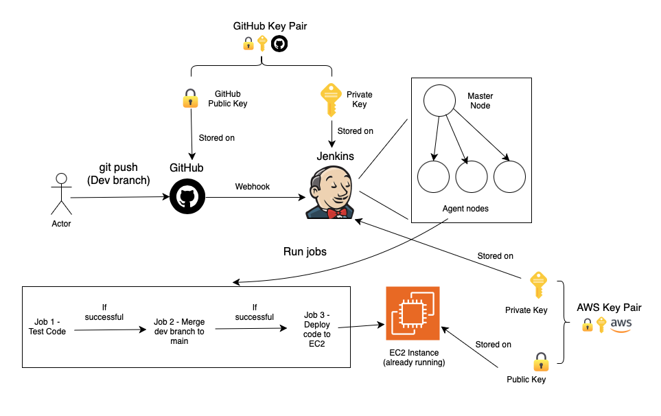
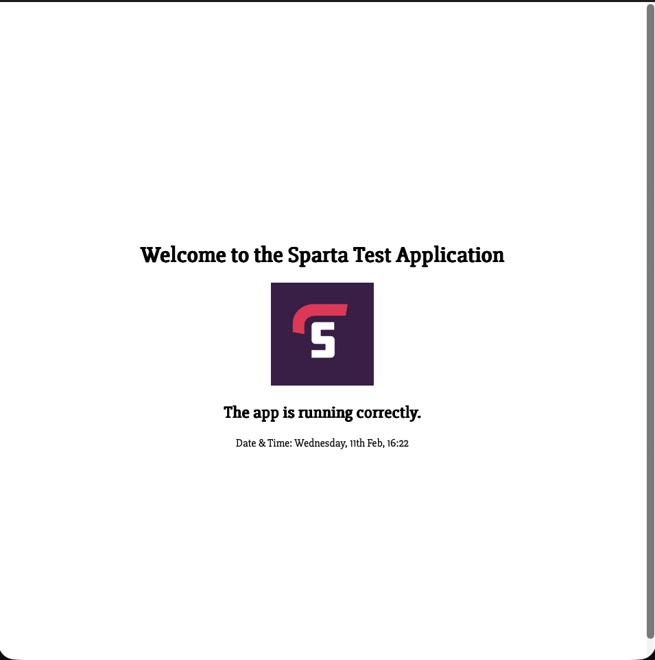
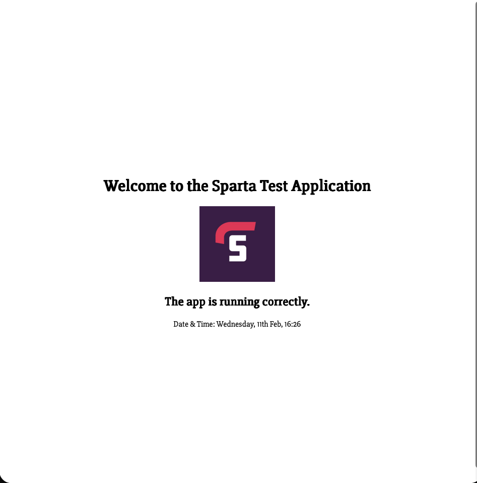

# Intro to Jenkins & CICD

## What is CI? Benefits?
* Continuous Integration
* Merging code
* Triggered by: Developers frequently pushing the code changes to shared repo
* Tests are run automatically on the code before it is integrated into the main code

Benefits:
* Help you to identify and resolve bugs early
  * Reduces costs
* Helps to maintain a stable and functional software build

## What is CD? Benefits?
* can mean:
  * Continuous Delivery (manual sign off/approval)
  * Or Continuous Deployment (automatically deploys code to production)
  
Continuous Delivery (manual sign off/approval)
* Ensure software is always in a deployable state, ready/can be pushed to production at any time
* often involves producing deployable artifact
* requires a manual release decision
* benefit
  * always have a deployable artifact ready to deploy to end users 

Continuous Deployment (automatically deploys code to production)
* extends Continuous Delivery by automating the final step of deploying to produciton 
* no manual intervention required
* benefit which is also a disadvantage:
  * removes the need for human approval, relies entirely on automated processes

## What is Jenkins?

* Automation server
* open-source
* primarily used for CICD, but can automate much more

## Why use Jenkins? Benefits of using Jenkins? Disadvantages?

* Benefits:
  * automation
  * extensibility: Jenkins has over 1800 plugins
  * Scalability: Jenkins server can scale easily by adding/using worker nodes/agents to run jobs
  * Community support
  * Cross-platform: Works across windows, linux, MacOS

* Disadvantages:
 * can be complex for beginners
 * Maintenance overhead
 * resource-intensive when running multiple jobs
 * User interface: outdated

## Stages of Jenkins

A typical Jenkins CICD pipeline involves the following stages: 
1. Source Code management (SCM)
2. Build: Compile the code, buidl into executable artifact
3. Test: Automated tests (unit, integration, etc)
4. Package: Package into deployable artifact
5. If using Cont. Deployment, the package is deployed into the target environment e.g. test, production
6. Monitor: Monitoring tools may be deployed/configured to observe performance, log issues, etc after deployment 

## What alternatives are there for Jenkins

* GitLab CI
* GitHub Actions
* CircleCI
* Travis CI
* Bamboo
* TeamCity
* GoCD
* Azure DevOps (Azure Pipelines to run the CICD pipelines)

## Why build a pipeline? Business value?

* Cost savings - automating repetitive processes
* Faster time to market
* reduced risk
* improved quality through continuous feedback and improvement

## What is a web hook, why is it needed in the context of a Jenkins pipeline? 

* A webhook is an HTTP callback: A way for one system to automatically notify another system when a specific even happens. Instead of repeatedly polling for changes, the source system pushes a message to a specific URL when something occurs e.g code is pushed
* The receiving system processes the event and triggers an action

## Our Pipeline



* The webhook is used to notify Jenkins, each time the code in the GitHub repository (dev branch) changes
* The different parts of the architecture connect securely using key pairs
* If the application code is changed e.g. in `app/views/index.js` then pushed to the dev branch, the pipeline executes
* If a job fails, the pipeline stops


## Jenkins Code Along

### Creating our First Job

The purpose of the first job is to run the application tests. 

Instructions to create job 1:

1. Log into the Jenkins server
2. Click new item
* Give the project a name
* Select **freestyle** project
* Click **ok**
* In the **General** section:
  * Give the project a description e.g. `testing jenkins`
  * Tick the box to discard old builds and set **Max # of builds to keep** to 5
* In the **Build Steps** section:
  1. click add build step
  2. choose execute shell
  3. paste `uname -a` into the text box

  4. click save

* When ready to run the job,click build now (manual)

## Viewing Console Output From a Job

* How to find out what happened:
  * Click on the project link from the dashboard
  * In the bottom left of the screen, click the link of the job execution
  * Click **console output**

## Triggering the Execution of Jobs

Jobs can be set to execute on the successful completion of another job:

1. Click on a job
2. Go to the **configure** section
3. Scroll down to **Post-build Actions**
4. Click **Add post-build action** then select **Build other projects**
5. Type in the name of the project you want to run after
6. Leave the **trigger only if build is stable** option selected


## Setting up the GitHub Key Pair

The Jenkins worker node requies the private key of the GitHub key pair to run git commands
such as `git merge`. 

1. Open a terminal window
2. `cd` into the .ssh folder
3. Run: `ssh-keygen -t rsa -b 4096 -C "<email address>"`
4. Name the key pair: `joshua-jenkins-github-key`
5. Log into GitHub
6. Navigate to the CICD repo
7. Go into the settings for the individual repo
8. Click deploy keys on the left menu
9. Click add deploy key
10. Set the key pair title: `joshua-jenkins-github-key`
11. Copy the public key into the text area:
    1.  Find the `.pub` file created by the `ssh-keygen` command
    2.  Use `cat` to print the key to the terminal
    3.  Copy the entire output to the text area on GitHub for the public key
12. Tick **Allow write access** option - needed for Jenkins to perform merge
13. Click **Add key**

## Jenkins codealong (setting up job 1)

* Enter item name: `joshua-sparta-app-job1-ci-test`
* Select Freestyle
* Click ok
* Add description: `do testing part of CI with webhook to trigger`
* Tick **Discard old builds**
  * Strategy: Log rotation
  * Max # of builds to keep: 5
* Tick GitHub project
  * Project url: `https://github.com/Joshua-Onley/tech517-sparta-test-app-cicd/`
  * ❗remove `.git` from URL and replace with `/`
* Scroll down to Source Code Management
  * Select Git
    * Repository URL: `git@github.com:Joshua-Onley/tech517-sparta-test-app-cicd.git`
    * Credentials: Add -> Jenkins
      * kind: SSH Username with private key
      * ID: name of key pair = `joshua-jenkins-github-key`
      * Username: `joshua-jenkins-github-key`
      * Description: read/write to repo
      * private key
      * click enter directly
      * click add
      * paste private key
* Branch specifier : */main
* scroll down to build environment 
  * select provide node and npm bin/ folder to PATH

## Jenkins Codealong (setting up webhook to trigger job 1)

* Select job 1 from dashboard
* Click configure
* Scroll down to build triggers
  * Choose GitHub Hook trigger for GITScm polling
* Click save
* Go to GitHub repo settings
* Go to webhooks section
* click add webhook
  * Payload URL: `http://34.254.6.118:8080/github-webhook/` (jenkins server)
* click add webhook


## Job 2

* Copy job1 but remove the webhook
* ❗Must add SSH agent in the SCM section otherwise git commands fail
* eval `` commadn to setup ssh agent locally
* In the execute shell section paste the following:

```bash
git checkout main
git merge origin/dev
git push origin main
```


## Job 3

scp command not working 

```
+ scp -r ./README.md ./app ubuntu@54.195.43.141:~
Host key verification failed.
```
SSH known hosts error

fix: add `-o StrictHostKeyChecking=no` into the scp command


## Working CI/CD pipeline

* Can make a change to the source code on my local machine and push to GitHub (Dev branch)
* The changes are automatically tested, merged with main (only if tests pass), and deployed to EC2 instance

1st change to frontpage: 



Second change to frontpage:




